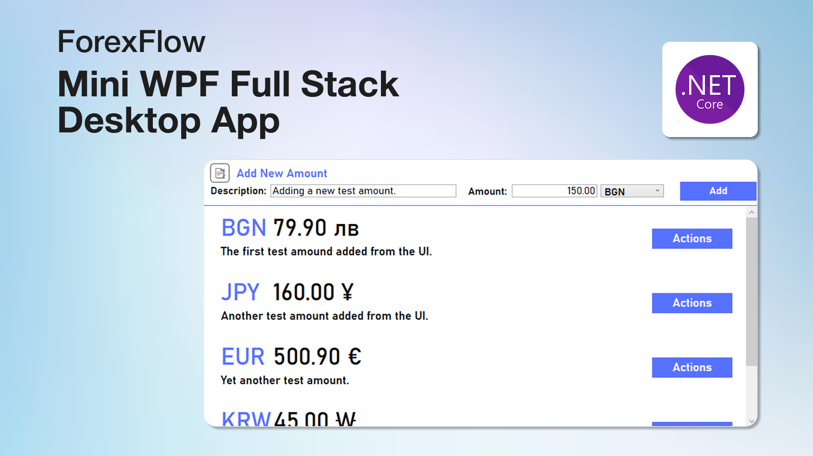

# 💱 ForexFlow – Currency Management & Invoicing App

### 🪙 Introduction

ForexFlow is a lightweight desktop application built as part of a university course project, initially assigned by my professor. The idea behind ForexFlow is to provide a functional and intuitive platform for managing currencies, calculating conversions, tracking amounts, and generating basic invoices.

The app is designed to give users a hands-on experience with handling foreign exchange data and practical financial operations. It serves not only as a useful tool but also as a demonstration of key software engineering principles.

ForexFlow is a WPF application developed using the .NET framework, showcasing my familiarity with C#, Entity Framework, and established architectural patterns such as MVVM (Model-View-ViewModel). The project also follows the Repository Pattern, promoting separation of concerns and maintainable code structure.

This project allowed me to explore the essentials of desktop app development and data-driven UI binding, while also reinforcing my skills in object-oriented programming, database management, and software architecture design.

🧾 Whether for coursework, a portfolio addition, or real-world currency/invoice handling, ForexFlow stands as a strong example of solid desktop app architecture in .NET.

### 💻 Tech Stack & Process of Development

This is a solo project, with all design, logic, and implementation completed independently. Below is an overview of the tools and technologies used:

UI/UX Design

XAML (WPF UI layout & styling)

#### Desktop Application (Frontend + Logic)

.NET (C#)

WPF (Windows Presentation Foundation)

MVVM Design Pattern

INotifyPropertyChanged, ICommand for ViewModel bindings

#### Backend & Data Access

Entity Framework

SQLite

Repository Pattern + Unit of Work

LINQ for querying data

### 📑 Detailed Overview & Documentation

For an in-depth breakdown of ForexFlow’s architecture, user flows, core components, and design decisions, a full PDF documentation is provided as part of this repository.

[Documentation](documentation/documentation.pdf)

🔔 Note: The documentation is currently available only in Bulgarian.

---

### Contact Me

### 📬Email: ganchev.professional@gmail.com

### 📌LinkedIn: [www.linkedin.com/in/alex-ganchev](https://www.linkedin.com/in/alex-ganchev)

---
